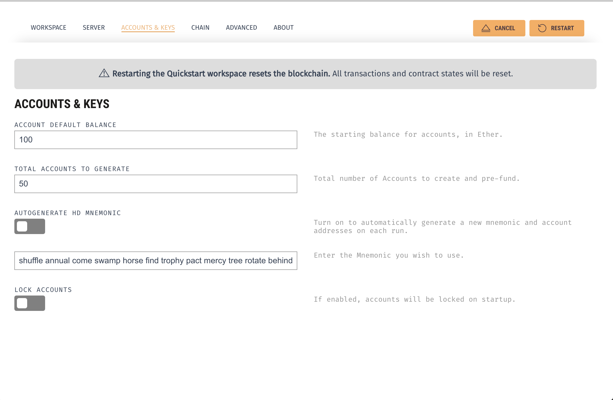
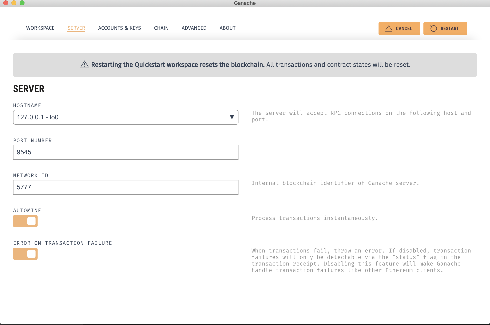
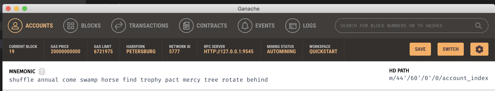

# Flight Surety

Udacity Blockchain Nano Degree project 7

# node, yarn version
- node@12.6.0
- yarn@1.17.3

# install

Run this command.

```
$ yarn
```

# settings

Create .env file in the project root directory and set environment variables like this.

```
MNEMONIC=<Your MetaMask mnemonic>
ACCOUNTS=<The number of accounts provieded by ganache-cli when it starts>
```

In order to start oracle server or pass tests, at least 30 accounts are needed. 

>You can also use Ganache userInterface app instead of below command. After running Ganache app go inside settings then 
```Account & Keys```
set total accounts to generate. Check below images.



As you can see in 3rd image copy your mnemonic string and paste it inside .env file.


# start ganache

Run this command. It starts ganache-cli according to your .env settings.

```
$ yarn run ganache
```

# deploy

Run these commands.

```
$ truffle compile
$ truffle migrate --reset
```


# start dapp

Run this command. It starts the dapp on localhost port 8000.

```
$ yarn run dapp
```

# start oracle server

Run this command.

```
$ yarn run server
```

By default, oracles submit flight status at random. If you want oracles to submit constant values, set environment variable STATUS_CODE and start server. For example.

```
$ STATUS_CODE=20 yarn run server
```

# test

Run this command.

```
$ yarn test
```
